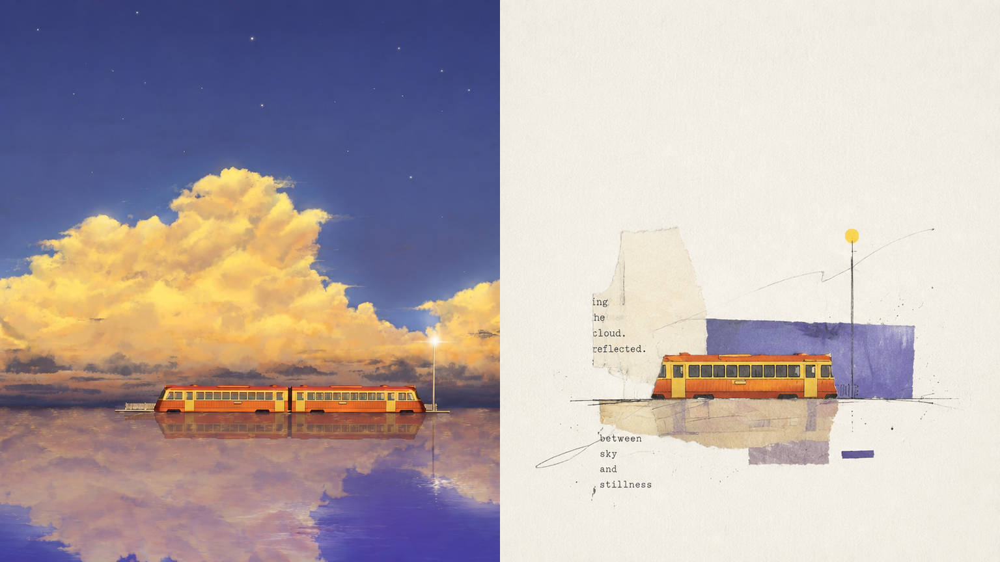
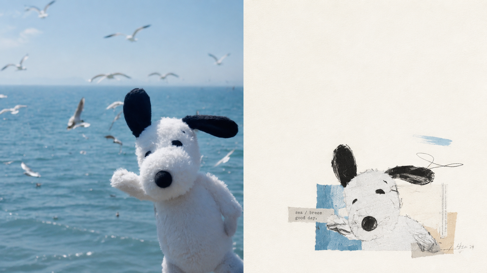
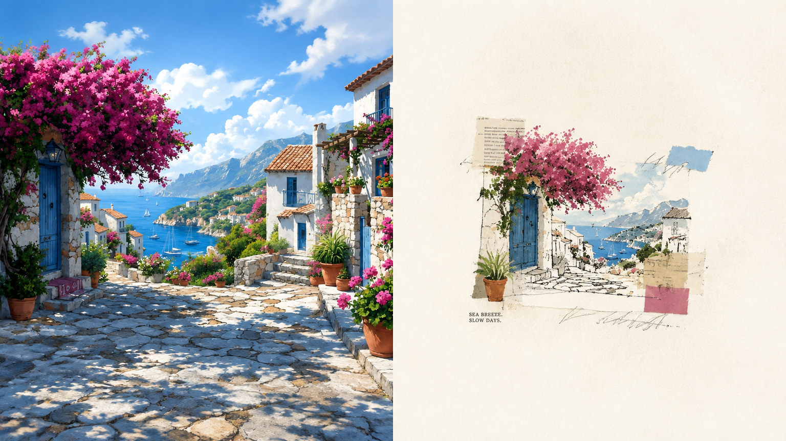
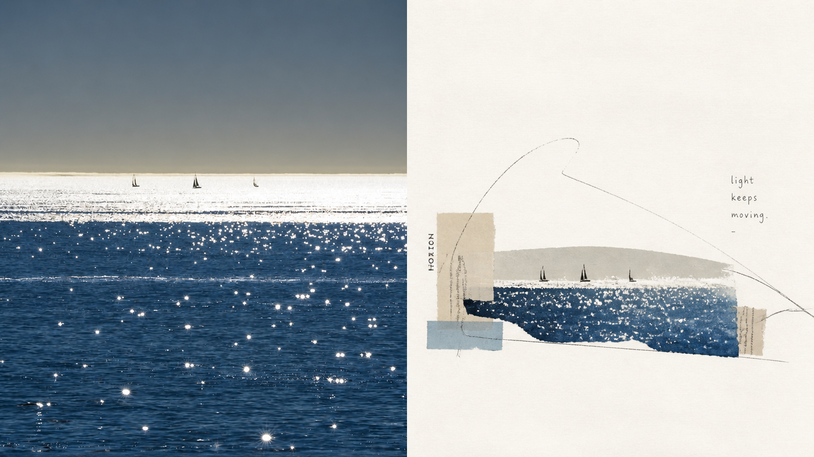
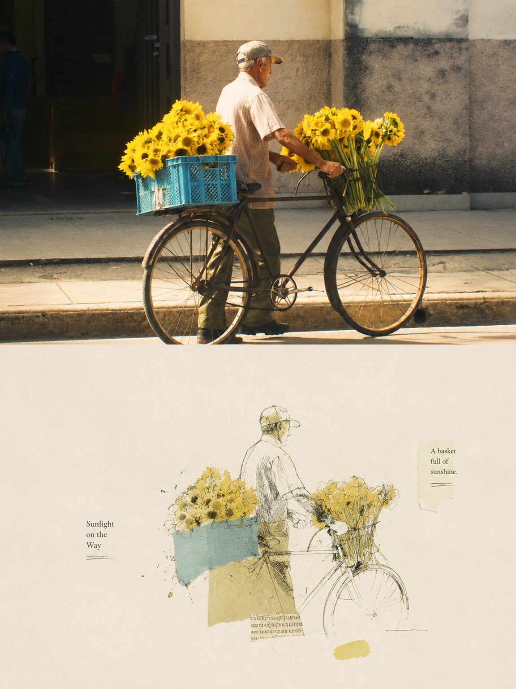
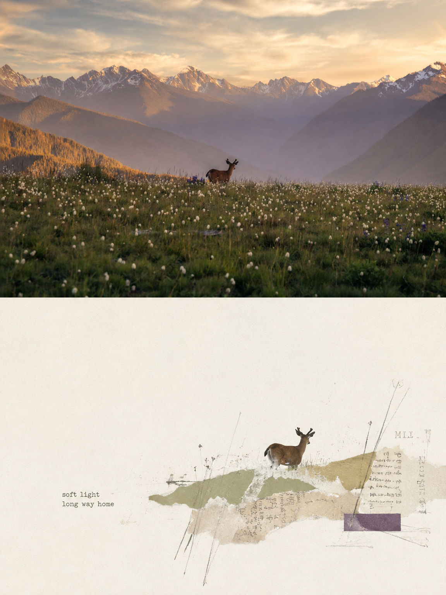
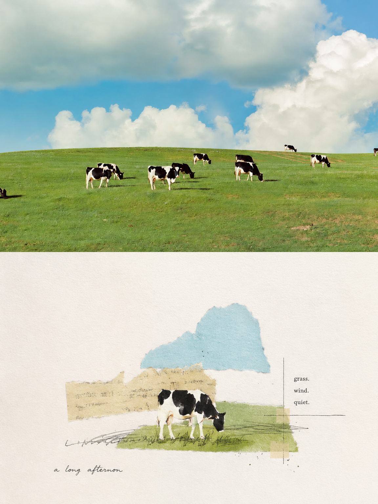

<div align="center">

# XXD Panel 158｜كولاج بخامات مختلطة على الورق

أعد إخراج صورة يومية كملصق فني مستقل، مع حفظ جوهرها المميز وإعادة التفكير في الخامة والتكوين والفراغ.

<a href="README.md">简体中文</a> · <a href="README.en.md">English</a> · <a href="README.ja.md">日本語</a> · <a href="README.ko.md">한국어</a> · <a href="README.ar.md">العربية</a>

</div>

## عرض النماذج

本项目已发布 8 张实际样片，包含横版与竖版，图片文件位于 `assets/examples/`。

| sample-05 | sample-07 | sample-09 | sample-11 |
| --- | --- | --- | --- |
|  |  |
| sample-07 | sample-08 |
|  |  |
| sample-09 | sample-10 |
|  |  |
| sample-11 | sample-12 |
|  |  |

## الحالات المناسبة والمشكلات التي يحلها

مناسب لمجموعات الصور الشخصية والنشر المستقل ودراسات المعارض والمرئيات اليومية. التكوين الضعيف أو الخلفية المزدحمة أو الموضوع الصغير نقطة انطلاق للاختزال وإعادة الترتيب والقص وتغيير المقياس، لا مجرد تطبيق فلتر.

استخلص في النصف السفلي فقط **الموضوع الأكثر تميّزاً وحدوده وبنيته ووضعيته وعلاقاته السردية**، وأعد بناءها كـ**رسم كولاج بخامات مختلطة على الورق / mixed-media collage on paper**. لا تنسخ الأشياء واحداً واحداً، ولا تحتفظ بكل العناصر، ولا تقلّد المشهد الأصلي. احذف بفاعلية معظم الخلفية والتفاصيل غير المرتبطة، وأبقِ فقط البنية والمسارات ونقاط الذاكرة البصرية الأقدر على تمثيل الأصل. أعد اختزالها عبر **كولاج الورق والخطوط اليدوية وقليل من المساحات اللونية وشظايا النص المطبوع والفراغ**، لتُعرف صلتها بالصورة العليا فوراً.

## الموجّه الأصلي · خمس لغات

[简体中文](references/original-prompt/zh-CN.md) · [English](references/original-prompt/en.md) · [日本語](references/original-prompt/ja.md) · [한국어](references/original-prompt/ko.md) · [العربية](references/original-prompt/ar.md)

يحفظ الملف الصيني نص المستخدم الأصلي حرفياً وهو المرجع الوحيد للإبداع والجماليات أثناء التشغيل. الملفات الأربعة الأخرى ترجمات كاملة وأمينة للقراءة ولا تعيد كتابة تعليمات التوليد.

## فحص الملاءمة السريع

احفظ هوية الأصل مع إعادة إخراج التكوين، واجمع ملمس الخامة والفراغ المقصود. اختر نصاً حرفياً أو مولداً أو بلا نص، مع معالجة صورة واحدة أو مجلد متداخل والأنماط الأربعة أدناه.

## منطق التحويل

فهم الموضوع والعلاقات ← استخلاص لغة النص الأصلي ← حذف التفاصيل غير المرتبطة ← إعادة تكوين المقياس والموقع والفراغ ← كلمات قليلة من الصورة ← فحص النسب والنص والنتيجة

## سمات النتيجة

تجمع النتيجة الراقية بين **الاستخلاص الانتقائي وكولاج الورق بالخامات المختلطة والخطوط اليدوية والبناء المجزأ والفراغ الفني الهائل والتنسيق التحريري**. تجنب إعادة رسم كل شيء على حدة، والخلفية الزائدة، وتكديس المعلومات، وملء اللوحة، والرسوم المتجهية الملساء، والمظهر الثلاثي الأبعاد، والقوالب التجارية، وتزيين الدفاتر الرخيص، والكرتون الطفولي.

## أنماط الإخراج الأربعة

- `top-bottom`: منطقتان أفقيتان كاملتا العرض فقط؛ الواقع في الأعلى والتصميم في الأسفل، 50% لكل منهما.
- `left-right`: منطقتان عموديتان كاملتا الارتفاع فقط؛ الواقع يساراً والتصميم يميناً، 50% لكل منهما، ولا يتحول إلى تخطيط علوي/سفلي.
- `design-only`: تعرض اللوحة الكاملة ترجمة Panel 158 التصميمية فقط، وتبقى الصورة مرجعاً غير ظاهر.
- `wallpaper-pack`: ينشئ عملاً كاملاً للهاتف وiPad وسطح المكتب والساعة، إما كعائلة `linked` أو أربعة أعمال `independent`.

يمكن جمع الأنماط والأحجام. تشمل النسب `1:1` و`3:4` و`4:3` و`4:5` و`5:4` و`2:3` و`3:2` و`9:16` و`16:9` و`21:9` و`5:7` و`7:5` والبكسلات الدقيقة. يمكن أن يكون النص مولداً أو حرفياً من المستخدم أو غائباً. عند إدخال مجلد، تُعالج كل صورة بمعزل عن الأخرى مع إعدادات تسليم مشتركة، وتوضع ملفات PNG النهائية مباشرة في مجلد مهمة جديد واحد.

## البدء

```bash
git clone https://github.com/nevertoday/xxd-panel-158.git
npx skills add https://github.com/nevertoday/xxd-panel-158 --skill xxd-panel-158
```

بعد التثبيت أعد تشغيل جلسة Agent ثم استدعِ `$xxd-panel-158`. ويمكن إضافة `--global --agent codex --yes` للتثبيت على مستوى المستخدم.

```text
/xxd-panel-158 photo.jpg --mode top-bottom --size 3:4 --text prompt --locale ar-SA
/xxd-panel-158 photo.jpg --mode left-right --size 16:9 --text prompt --locale en-US
/xxd-panel-158 photo.jpg --mode design-only --size 9:16 --text none
```

راجع [SKILL.md](SKILL.md) لعقد التشغيل الكامل، ومهايئ التشغيل [بالإنجليزية](references/xxd-panel-158-prompt.en.md) أو [بالصينية](references/xxd-panel-158-prompt.zh-CN.md).

<!-- xxd-readme-ads:start -->
## عن XXD

XXD هو اختصار اسم علامة Xiaoxiaodong. أنشأ المشروع ويديره: [@xiaoxiaodong01](https://x.com/xiaoxiaodong01).

## الدعم والعضوية

> **إفصاح إعلاني:** رموز QR وروابط العضوية والخدمات المدفوعة في هذا القسم هي مواد ترويجية من XXD. المسح أو الشراء اختياري ولا يؤثر في استخدام المشروع المفتوح المصدر.


<!-- xxd-panel-command-system:start -->

تشمل العضوية الموحدة بسعر 699 يواناً صينياً سنوياً جميع Skills الجنرالات، ولا يلزم شراء منفصل.

| المستوى | Skill | المسؤولية |
|---|---|---|
| **الجنرال** | [`xxd-panel-all`](https://github.com/xiaoxiaodong-ai/xxd-panel-all) | اكتشاف Skills المرقمة المتاحة، والتوصية حسب الصورة أو الموضوع أو الاستخدام، واستدعاء رقم محدد، وتنظيم تجارب متعددة الأساليب، وتوزيع صور المجلد على مهام منفصلة. |
| **الجنود** | `xxd-panel-NNN` | تنفذ كل مهارة مرقمة موجّهها الأصلي وجماليتها الخاصة فقط، وتنجز المهمة الفردية التي يرسلها الجنرال. |

<!-- xxd-panel-command-system:end -->

### Knowledge Planet＋مكتبة توجيهات الأعضاء＋عضوية جميع Skills الجنرالات · 699 يواناً صينياً/سنة

تشكل [Knowledge Planet](https://wx.zsxq.com/group/15554814142882) و[مكتبة توجيهات XXD](https://vip.xiaoxiaodong.ai/) وعضوية جميع Skills الجنرالات عضوية واحدة: **دفعة سنوية واحدة تفتح المزايا الثلاث من دون شراء ثانٍ.**

[Knowledge Planet](https://wx.zsxq.com/group/15554814142882) · [Member Prompt Library](https://vip.xiaoxiaodong.ai/)

<p align="center"><a href="https://xiaoxiaodong.pages.dev/assets/wechat-qr.png"></a></p>
<!-- xxd-readme-ads:end -->

## الترخيص

يخضع هذا المشروع—بما فيه Skill والموجّهات والبرامج النصية والوثائق ونماذج الصور المرفقة—لترخيص **PolyForm Noncommercial License 1.0.0**. راجع [LICENSE](LICENSE) للاطلاع على النص القانوني الكامل، و<https://polyformproject.org/licenses/noncommercial/1.0.0> للصفحة الرسمية.

بلغة بسيطة:

- يجوز للأفراد استخدامه للتعلم والبحث والتجارب والاختبار ومشاريع الهوايات والترفيه الخاص. كما يجوز للجمعيات الخيرية والمؤسسات التعليمية وهيئات البحث أو السلامة أو الصحة العامة ومنظمات حماية البيئة والمؤسسات الحكومية استخدامه.
- للأغراض **غير التجارية**، يجوز لك استخدامه ونسخه وتعديله وإنشاء أعمال مشتقة منه ومشاركته. وعند المشاركة، يجب إرفاق هذا الترخيص (أو الرابط أعلاه) وجميع عبارات `Required Notice:` التي قدمها المؤلف.
- لا يجوز استخدامه في منتجات أو خدمات تجارية، أو تسليمات مدفوعة، أو بيع حق الوصول أو التراخيص، أو أي استخدام متوقع أن يؤدي إلى تطبيق تجاري. احصل على إذن كتابي منفصل من صاحب حقوق النشر قبل الاستخدام التجاري.
- لا تمنح الاتفاقية سوى ترخيص حقوق النشر والترخيص المحدود لبراءات الاختراع المنصوص عليهما صراحةً. ولا تمنح علامات تجارية أو أسماء علامات أو حقوقاً أخرى غير مذكورة، ولا يجوز لك منح ترخيصك من الباطن للآخرين.
- إذا تلقيت إشعاراً كتابياً بمخالفة، فعليك العودة إلى الامتثال واتخاذ خطوات عملية لمعالجة المخالفة خلال 32 يوماً، وإلا تنتهي التراخيص فوراً. كما يؤدي الادعاء الكتابي بانتهاك براءة اختراع إلى إنهاء ترخيص البراءة.
- تُقدَّم المواد «كما هي» ومن دون أي ضمان بالقدر الذي يسمح به القانون. ويتحمل المستخدم مخاطر الاستخدام وخسائره المحتملة.
